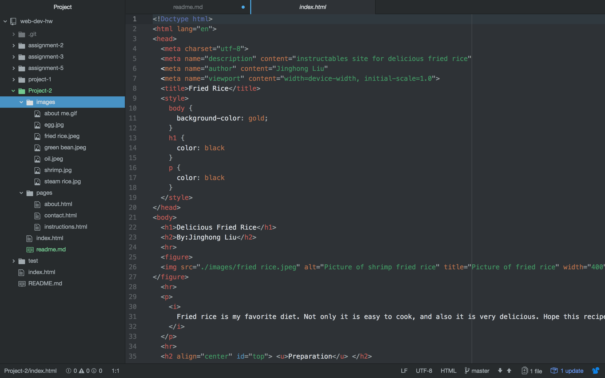

# Project 2

1:With the learning of HTML, I think this is a useful and also a easy tool to design a website. In this topic I learnt some basic concepts about the HTML, and understood what really is HTML, and what elements make up the HTML. On the other hand, I am also got over too many troubles in the learning of HTML. Overall, this learning cycle bring me lots of useful experiences and knowledge.

2:I heard CSS before, but I still do not know what exactly it is. I hope I can understand the meaning of CSS and also know how to use it correctly.

3:For this project, I spent lots of time to turn back review the past topics. There are lot of points need to reuse the past topics, that really let me feel little bit confused. Thus, I have to turn back to past topics one by one and refresh my memories.

4:
