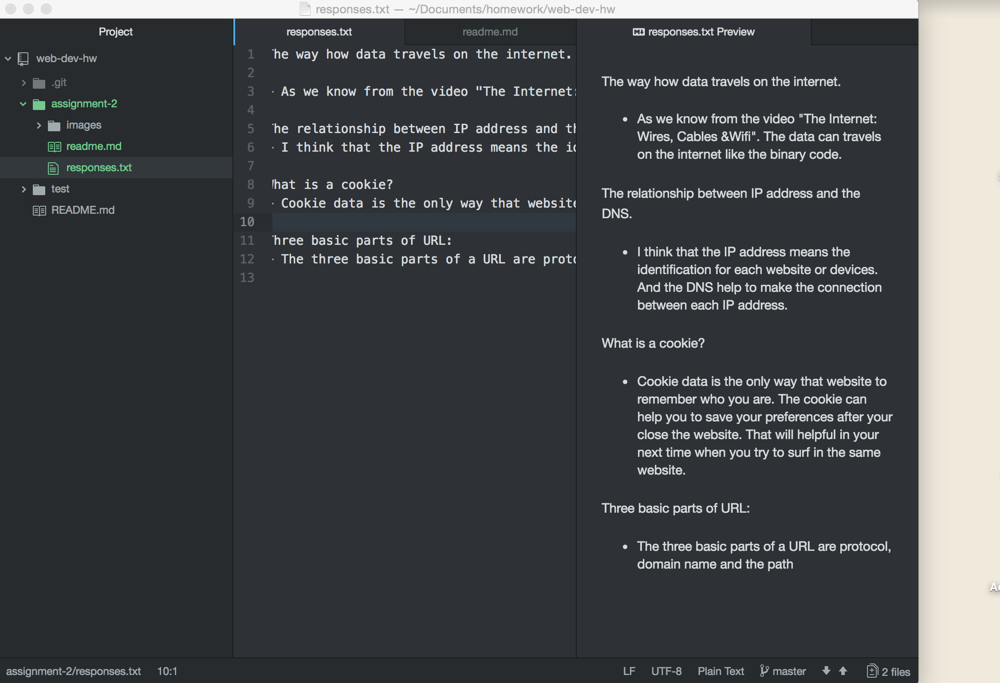

# Assignment 2

The Version Control help us can change the file or check our file changes at anytime. And because of the Version Control System, we can simply make change for any wrong coding. From another hand, this system also allow our project easy to share or collaboration. The reason why we need this system for class, not only we are the starter of coding, this system can allow us esay to fix any coding error, and also we can share our project to each other classmates.

There is my [responses](./responses.txt) regarding internet protocols and systems.

This assignment was difficult but rewarding for me, because:

In this assignmetn, I learnt how is the internet work in our life. And also get the basic knowledge about the IP, URLs, DNS, HTTP and HTML. And also I found out how important is the file management or folder structure in website design. The most important things that I learnt from this part is how to post or share project on the Github for the web design. And lastly, we figure out how to make the internal, same-level and deeper-level linking.

I was very confused about the Github before this assignment, I do not know what is exactly use for. After I learnt from this part, I think this can be a useful tool in this semester and even my future career.

