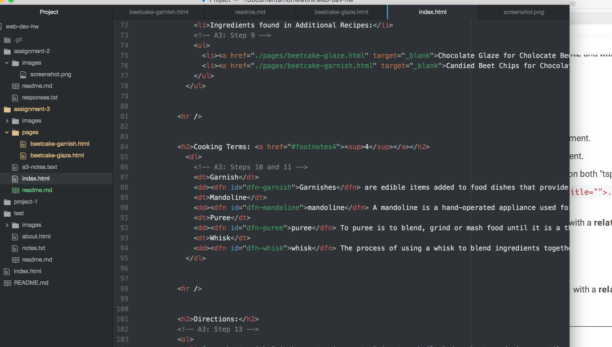

# Assignment 3

One page should have one head and one body, and there are two tag for head and also same with body, which is one open tag one close tag for both of them. The head element can provide us some basic information about the webpage, like title. And the body element provide more detail about the webpage.

Structure markup is more like use the structural elements make the webpage looks like more organized and also make the webpege's layout more easy to access. And for the semantic markup, the semantic elements can help the webpage to define its content. Makes the content's meaning more clearly.

In this work cycle, I developed more way to design a better or functional website with HTML. There are a lots of elements in this work cycle, but I really can not remember those elements codes, so I have to check the codes on the course website each time when I doing the assignment. And it was not easy to understand the function of those elements before I start to doing the assignment. And this work cycle also let me learnt more useful things to design a good webpage.

