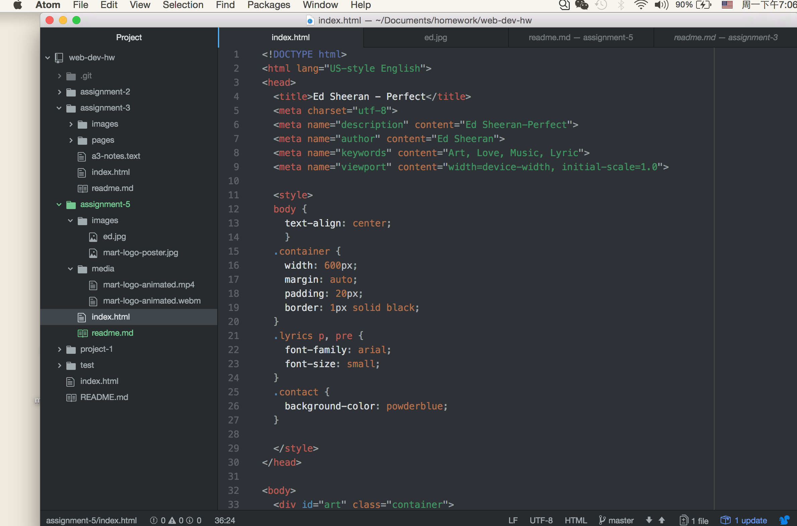

# Technical Report
1:From this section, I found that the divs is used to make the groups of some other HTML tags. And help to make the clearly section. The class attribute is helping to make easy to style the elements.And for the ids, I think it use to identify the particular section. The span can use to make the divs more unique and specific.

2:Because of the third party hosting can save more cost.

3:I think this assignment is bring me lost of challenges. Because of when I doing this assignment, I have to review some past topics, and then to refresh my memories.

4:
