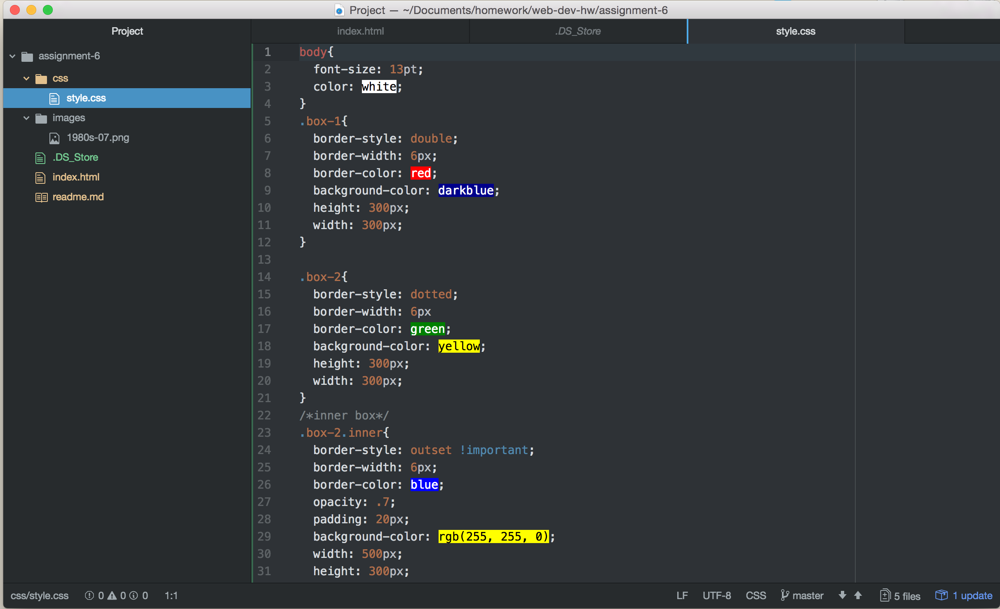

# Assignment 6

1:The graphic that I choose is come from the 1990's. The reasons that I choose this image, because I think the 1990's are more like kind of people that have the energy and power. And also I made this page looks colorful, in order to present the colorful life of the 90's.

2: I choose red, green, blue ,darkblue and also yellow as my pages color.

3:To be honest, I spent lots of time on this assignment, it is not easy for me to understand those codes of CSS, but I think this should be a useful tool for me.

