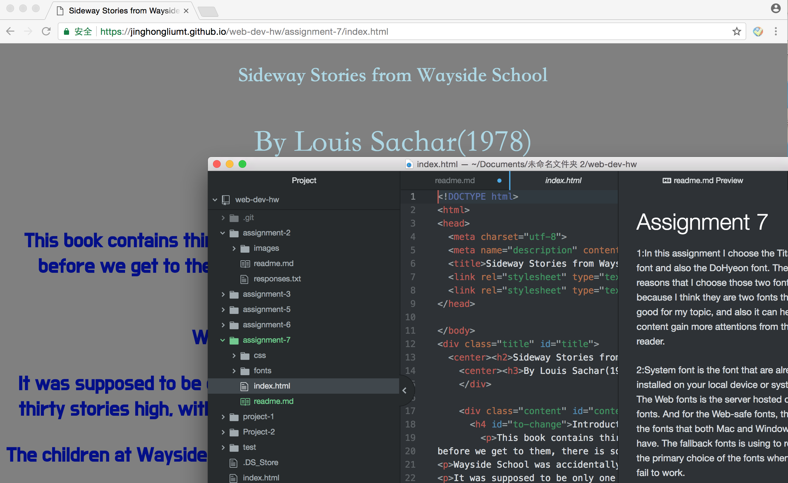

# Assignment 7

1:In this assignment I choose the TitanOne font and also the DoHyeon font. The reasons that I choose those two fonts because I think they are two fonts that good for my topic, and also it can help the content gain more attentions from the reader.

2:System font is the font that are already installed on your local device or system. The Web fonts is the server hosted custom fonts. And for the Web-safe fonts, they are the fonts that both Mac and Windows have. The fallback fonts is using to replace the primary choice of the fonts when they fail to work.

3:For the work cycle for this assignment, I have to say I was confused about how to use the fonts style to make my website looks more professional before I learnt this lessons. I also got into lots of trouble when I doing this assignment, but with the help of the class materials I can found out them and also solve them.

4:
