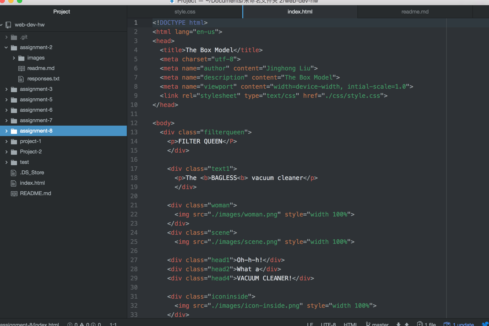

# Assignment 8

## What is the difference between padding, margin, and borders?

The Padding is kind of space that exist between the content and the element.
And the Margin should be the space that between the box and the element. For the borders, it is more like the frame of the box.

## The hardest task for me

In this assignment the hardest part should be how to place the elements to right place. I used lots of time try to figure out what is the problem with my coding. But I still did not figure out by myself. I do not know if there are some problem in my css coding or html coding. I see there is one classmate have the same problem with me on Github issue board.

## My Work Cycle.

This assignment spent me lots of time, but I think this assignment should be useful for me.

